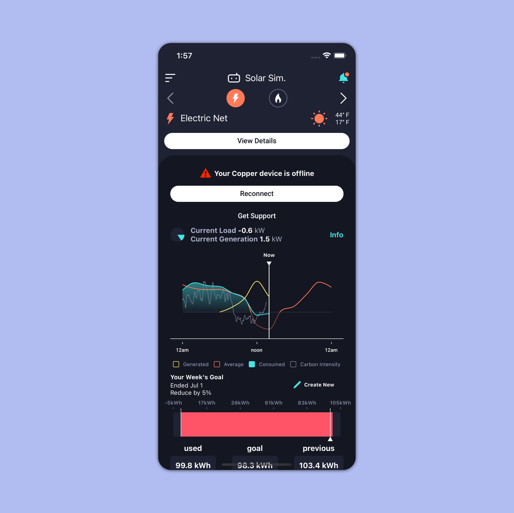
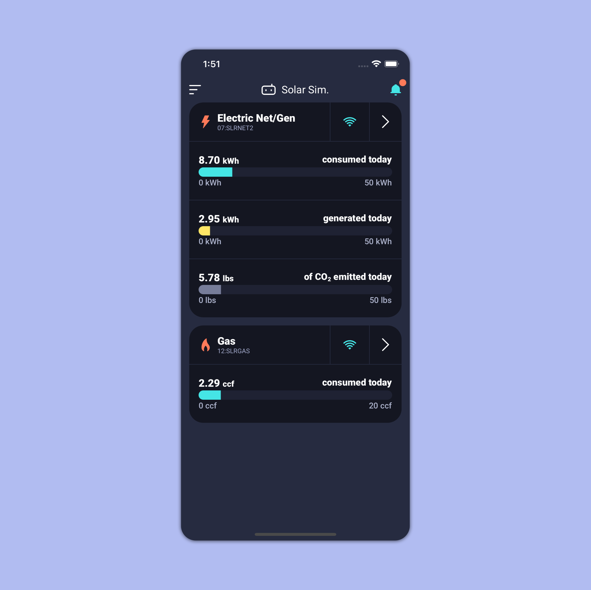

# Background

Copper shows you how much electricity, gas, and water you use over time. It requires installing a Copper device in your home, registering your residence’s utility meters, and synching with a mobile app. The app then displays your utility usage and your emissions data. It notifies you of peak demand events and anomalies so that you can better manage your consumption.

# Before

Copper was first designed to track electric meters only. In those days, the entire screen was dedicated to showing any electric data.

When Copper added water and gas meters, they added a toggle to switch between each meter. The user would select water, and see an identical screen that displayed water data instead of electric data.

One problem became clear. Many users did not know they could toggle between meters. That means they did not know how to see their water and gas data after installing their water and gas meters. This was the most pressing problem to solve.

Through user research, we also learned that many users couldn't make much sense of the line charts.

The engineering team, including myself, was also concerned that this current approach was becoming cluttered. Every new feature was just being slapped on wherever it fit, and we didn't know where to place some upcoming features.

# After

The new design displays all of the user's meters on one screen and gives a readable total value for the current day's consumption. It also displays your meter's connection status.

Users can also tap the arrow on the right of each meter card to get high-resolution data for the meter.

Any time-sensitive messaging can be added as a separate card at the top of the screen, and any new features can be added as separate cards or areas in this new scrollable display.

For quick delivery and expedited user feedback, the number at the end of the bar graph was decided slightly arbitrarily based on ballpark estimates of national averages. In the future, we might apply dynamic values based on weather, user history, user goals, or other useful factors.

This project also marked the beginning of applying material design more strictly throughout the mobile app in order to enforce consistent design decisions.

# My Role 

I designed and implemented the new information structure and UX. I honed in on the design and correct technical approach with user feedback and constant in-house testing.

# Outcome

Higher visibility of users' meters resulted in a significant decrease in support tickets regarding meter installations. According to our Hubspot analytics, we had approximately 60% fewer tickets for three months compared to the three months before the release.
