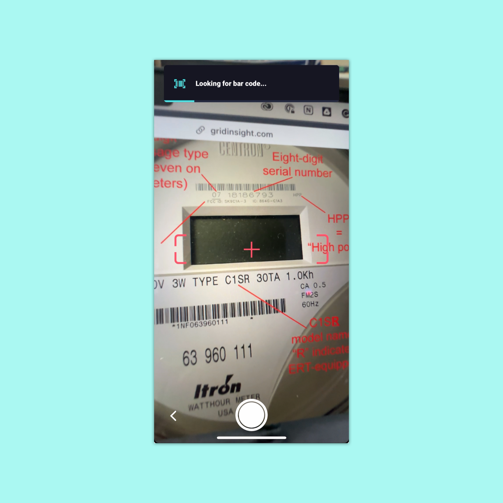
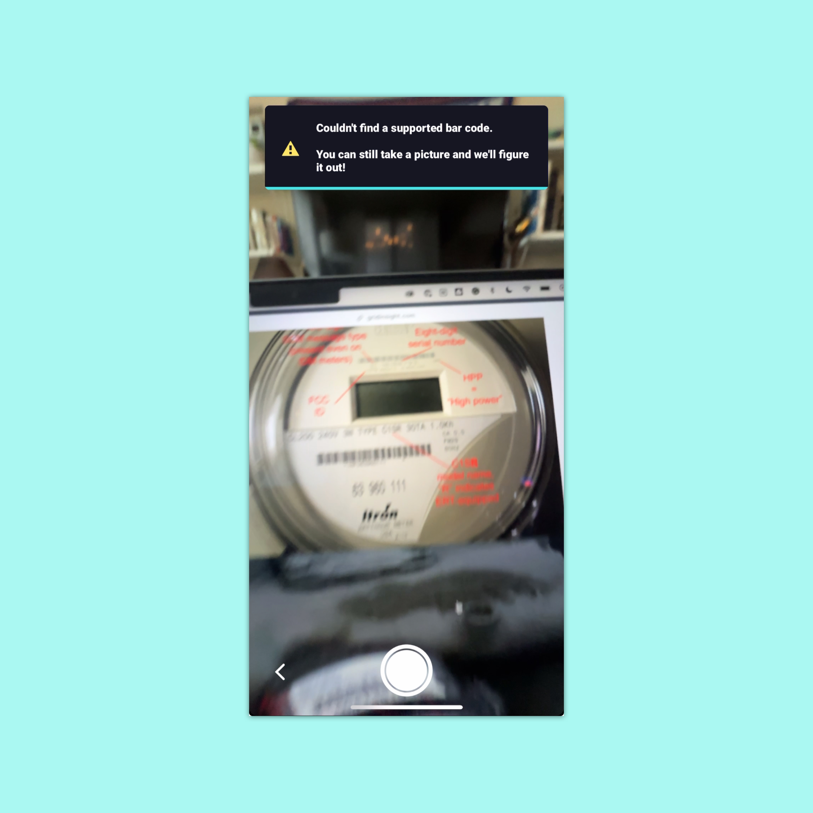

# Background

Copper Labs' user onboarding was made up of three components:
- Creating a home
- Connecting the Copper IoT device to Wi-Fi
- Adding a utility meter. 

Issues arose during meter addition. We received a large amount of mislabeled meters, such as gas meters labeled as water meters. The problem was that we passed the responsibility of labeling the meter to the user, who was just given our IoT device by the energy company. They weren't enthusiasts who sought our product. Even though many were excited by the product, most weren't the type to think about their meters much.

Our first solution was a backend process that would analyze a meter's data over time to determine the probability that a meter was mislabeled. This was a technically exciting solution but highly impractical.

# Solution

After digging into the data, I noticed patterns in the barcode IDs of different meter types. We discovered we could accurately determine the meter type with active barcode scanning.

We added active barcode scanning with messaging to encourage the user to look for the barcode. We also added a timer that disabled the camera button for 10 seconds. Since meters have many barcodes, we added visual indicators if the user tried to scan the incorrect barcode. If the barcode was found, we had nothing else to ask from the user. We then sent the relevant data to the server, and they were done.

If the user couldn’t find a barcode in 10 seconds, we would revert to the old process (slightly redesigned). This was important since it wasn’t uncommon for barcodes to be unscannable because of dirt or damage.

# Outcome

After shipping this feature, the data — along with visual verification from team members — confirmed that the amount of mislabeled meters had reduced significantly. This cut costs by reducing the use of asynchronous backend processes and gave users an easier meter onboarding experience.
